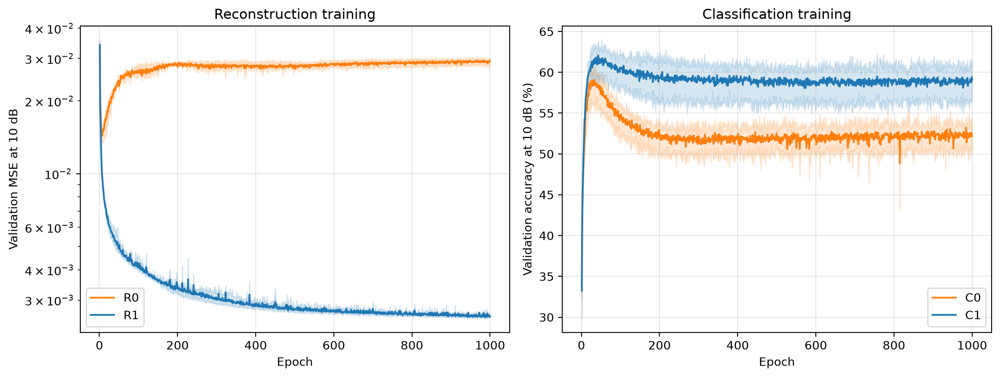
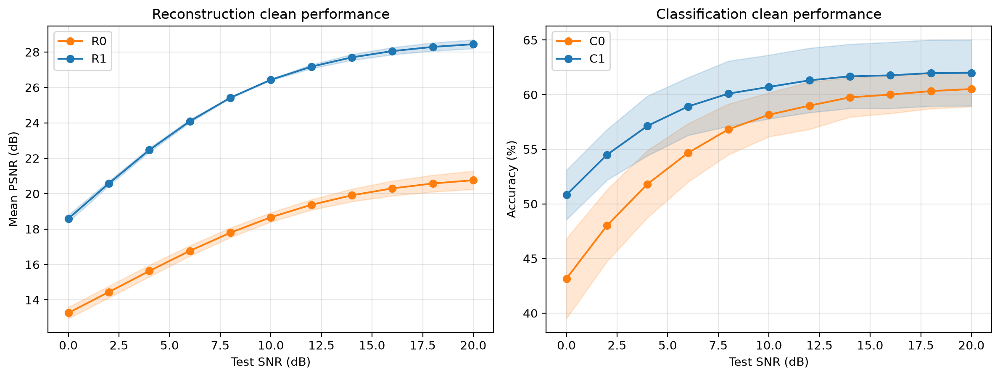
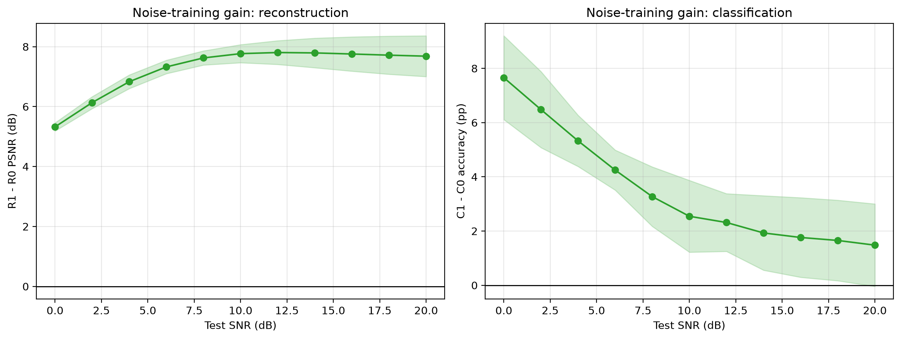
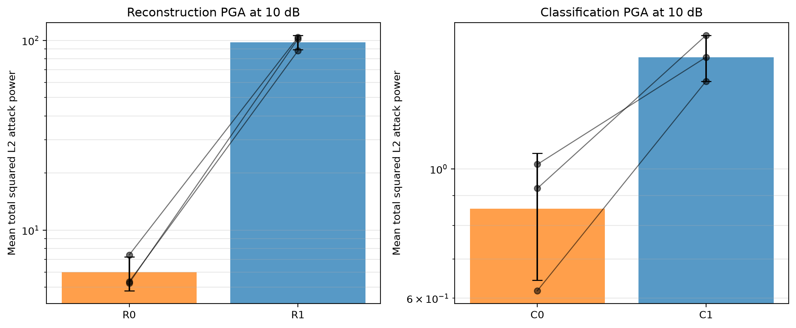

# CIFAR-10 任务 × 噪声 2×2：三种子正式结果

## Material Passport

- Origin Skill: academic-research-suite / experiment-agent
- Origin Mode: run + validate
- Origin Date: 2026-08-13
- Verification Status: VERIFIED（12 次训练与 clean 评估）；ANALYZED（探索性 PGA）
- Version Label: factorial_2x2_results_v1

## 一句话长期结论

三种子正式对照一致表明：**10 dB AWGN 训练在重建和分类中都改善普通信道泛化，也在当前 PGA 诊断中提高攻击所需功率；因此现象不是连续重建任务独有，噪声训练/信道匹配是主要因素之一。** 但当前实验尚未隔离通信结构，攻击也没有达到确认性强度，不能声称已证伪所有语义通信鲁棒性，也不能推出全局 Lipschitz 常数 `G` 小。

## 实验完成状态

- 4 个实验单元：R0、R1、C0、C1；
- 独立训练种子：2026、2027、2028；
- 共 12 次训练，每次 1000 epoch；
- 全部退出码 0，1000 行日志、best/last checkpoint 和 manifest 齐全；
- clean：每个 best checkpoint 使用 10,000 张 CIFAR-10 test 图；
- 测试 SNR：0–20 dB，步长 2 dB；
- 每个 SNR、每个训练种子使用三次独立信道噪声；
- 探索性攻击：10 dB、每模型前 128 张图、PGA、单起点。

批次注册表位于 `outputs/factorial/factorial_2x2_three_seed_batch/registry.csv`；Git 可保留的精简证据位于 `results/factorial_2x2/`。

## 训练结果

| 单元 | 最佳 epoch | 最佳验证指标（三种子均值） | epoch 1000 指标 | 观察 |
| --- | --- | ---: | ---: | --- |
| R0 | 5、8、7 | MSE 0.01426 | MSE 0.02914 | 无噪训练后期对 10 dB 验证严重退化 |
| R1 | 942、1000、992 | MSE 0.002534 | MSE 0.002558 | 长期缓慢改善，末轮接近最佳 |
| C0 | 20、20、20 | accuracy 58.59% | accuracy 52.17% | 明显过拟合 |
| C1 | 18、29、26 | accuracy 61.48% | accuracy 59.11% | 仍过拟合，但弱于 C0 |

R0 的无噪训练 MSE 在训练集上持续降低，但共同 10 dB 验证 MSE 在约 5–8 epoch 后持续上升。这说明“能精确重建训练图像”不等于“编码对信道噪声稳定”。R1 的随机 latent 噪声兼具训练—测试信道匹配和强正则化作用。

## 多 SNR clean 结果

### 关键单点

| 单元 | 0 dB | 10 dB | 20 dB |
| --- | ---: | ---: | ---: |
| R0 PSNR | 13.26 dB | 18.67 dB | 20.76 dB |
| R1 PSNR | 18.59 dB | 26.43 dB | 28.44 dB |
| C0 accuracy | 43.17% | 58.16% | 60.51% |
| C1 accuracy | 50.82% | 60.70% | 61.99% |

误差带是三个**训练种子间标准差**；三次信道重复用于减少每个模型曲线的 Monte Carlo 噪声，没有冒充独立模型重复。

### 噪声训练的配对增益

- 重建 R1−R0 PSNR 在全部 SNR 为正：0 dB 为 +5.32 dB，10 dB 为 +7.77 dB，20 dB 为 +7.68 dB。
- 10 dB 三种子值为 `7.94、7.42、7.94 dB`，均值 `7.77 dB`，种子间 SD `0.30 dB`，df=2 的 95% t 区间 `[7.02, 8.52] dB`。
- 分类 C1−C0 accuracy 在全部 SNR 为正，但随 SNR 升高而缩小：0 dB 为 +7.66 pp，10 dB 为 +2.54 pp，20 dB 为 +1.48 pp。
- 10 dB 三种子值为 `1.63、4.06、1.94 pp`，均值 `2.54 pp`，SD `1.32 pp`，95% t 区间 `[-0.75, 5.83] pp`。

10 dB 配对标准化均值差为：重建 `dz=25.75`、分类 `dz=1.92`。前者巨大是因为三个种子的增益数值高度一致，不应脱离原始 dB 值解读。三个配对差异都同向，但 n=3 时精确双侧符号检验的最小 p 值只能是 0.25。因此重建的效应大小和稳定性很强，分类方向也一致，但这些 `dz` 与区间在 n=3 下仍很不稳定，不应包装成“小 p 值显著”。

## 探索性 PGA 对抗诊断

### 设计与成功率

- SNR 固定为 10 dB；
- 每个模型使用前 128 张测试图；
- 重建失败阈值沿用论文 15 dB PSNR；
- 分类失败为真实类别 logit margin 降到 0；
- 分类只在 clean-correct 样本上统计；
- 所有纳入样本最终攻击成功率均为 100%，没有求解失败截尾。

### 跨种子结果

| 对照 | 三种子 mean-power ratio | 几何均值 |
| --- | --- | ---: |
| R1 / R0 | 16.46×、14.03×、19.33× | 16.46× |
| C1 / C0（各自 clean-correct） | 2.29×、1.53×、1.83× | 1.86× |
| C1 / C0（共同 clean-correct） | 2.46×、1.55×、1.91× | 1.94× |

分类共同样本数分别为 56、65、67。共同样本分析避免了 C0/C1 clean accuracy 不同导致的样本集合混杂。

### 为什么不能把 16.46× 直接解释为 smoothness

攻击功率与 clean-to-failure margin 在每个单元内高度相关：R0 的 Pearson `r` 约 0.70–0.82，R1 约 0.52–0.63；分类各组约 0.85–0.89。R1 的平均重建 margin 也大于 R0。因此当前功率差至少同时包含：

1. clean 性能/margin 更好；
2. 可能的局部平滑性变化；
3. 固定 15 dB 阈值的尺度效应；
4. PGA 步长和首次越阈规则的离散化。

若要检验论文关于 `G` 或 smoothness 的解释，必须进一步做阈值/margin 匹配、局部 Jacobian 谱范数、C&W/独立求解器和多重重启。当前 PGA 只能说明在**给定模型、阈值和求解器**下，带噪训练模型表现出更高经验攻击功率。

## 对原研究问题的判读

### 得到支持

1. 噪声训练是普通信道稳健性的重要因素，且效应跨任务出现。
2. 连续重建本身不保证对信道噪声稳健：R0 后期能拟合无噪训练集，却在噪声验证上恶化。
3. 分类任务也出现 clean 和经验 PGA 收益，所以现象不是重建任务独有。
4. 重建上的经验攻击功率增幅远大于分类，提示任务损失、阈值或输出几何仍可能放大论文现象。

### 尚未得到支持

1. 尚不能证明“语义通信结构完全无贡献”，因为四组都保留 encoder、功率归一化、768 维瓶颈和信道接口。
2. 尚不能证明 `G` 小或得到全局认证鲁棒性。
3. 尚不能声称 PGA 结果是可靠最小攻击功率：没有 C&W、多重随机重启、成功后二分精修和独立实现。
4. 尚不能直接比较“重建比分类鲁棒多少”，两任务的失败事件和尺度不同。

## 统计与方法谬误扫描

- Coverage：11/11 checked。

| 类型 | 严重度 | 本次判断 |
| --- | --- | --- |
| Simpson 悖论 | NOTE | 三个种子内方向与聚合方向一致，未见反转；类别子组尚未分析 |
| 生态谬误 | CAUTION | 种子级均值不能推出每张图都同样稳健，保留逐样本攻击数据 |
| Berkson 悖论 | NOTE | 没有按结果筛选训练模型；分类攻击明确限定 clean-correct，并另做共同样本分析 |
| Collider bias | CAUTION | 按 clean-correct 条件化可能改变样本分布，因此报告全体 clean accuracy 与共同样本口径 |
| Base-rate neglect | NOTE | 分类报告 clean-correct 数量和总样本数，没有隐藏准确率基率 |
| Regression to mean | NOTE | 未按极端种子选择模型；固定预先声明的三个种子 |
| Survivorship bias | NOTE | 12 次训练和 12 次 clean/PGA 均完成；攻击同时报告成功率 |
| Look-elsewhere effect | CAUTION | 多 SNR、多指标属于多重探索；10 dB 是预先关注点，其余作为曲线解释 |
| Garden of forking paths | CAUTION | PGA 样本数、阈值和求解器仍有研究者自由度；在确认性攻击前冻结方案 |
| Correlation ≠ causation | RED_FLAG | 攻击功率与 margin 高度相关，不能把功率差直接归因于 smoothness 或语义机制 |
| Reverse causality | NOTE | 训练噪声先于结果，不是主要问题；机制中介方向仍未实证 |

## 下一步固定顺序

1. 保存当前 12 个 best checkpoint 和本报告，不再根据后续攻击结果重选训练模型。
2. 预注册确认性攻击：共同样本、多个阈值/匹配 margin、PGA 多重重启和 C&W 交叉验证。
3. 估计接收 latent 处 task head 的局部 Jacobian 谱范数，检验它是否随噪声训练下降并与攻击功率关联。
4. 加入 non-channelized 参数量/latent 匹配基线，才开始回答通信结构是否有独立贡献。
5. 若资源允许扩展至五个训练种子，分类 clean 效应目前的不确定性尤其需要收窄。

## 可复查文件

- `results/factorial_2x2/analysis_summary.json`
- `results/factorial_2x2/training_summary.csv`
- `results/factorial_2x2/clean_summary.csv`
- `results/factorial_2x2/paired_clean_effects.csv`
- `results/factorial_2x2/pga_10db_seed_summary.csv`
- `results/factorial_2x2/pga_10db_classification_common_correct_effects.csv`

生成脚本：`scripts/evaluate_factorial_clean.py`、`scripts/evaluate_factorial_pga.py`、`scripts/analyze_factorial.py`。
