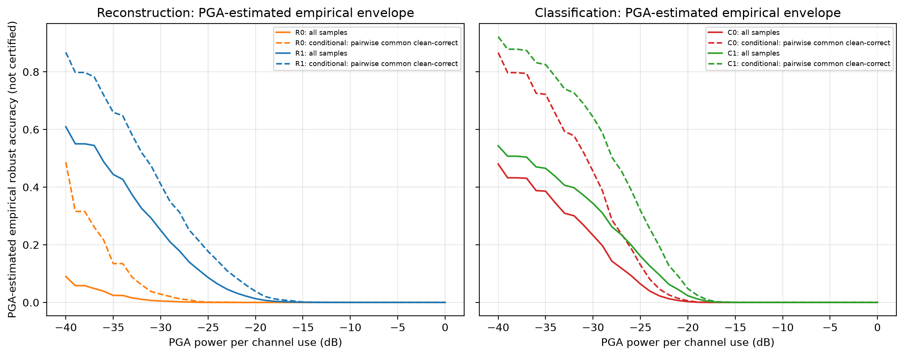
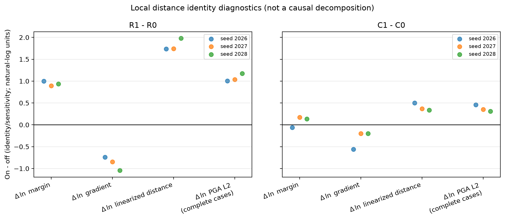
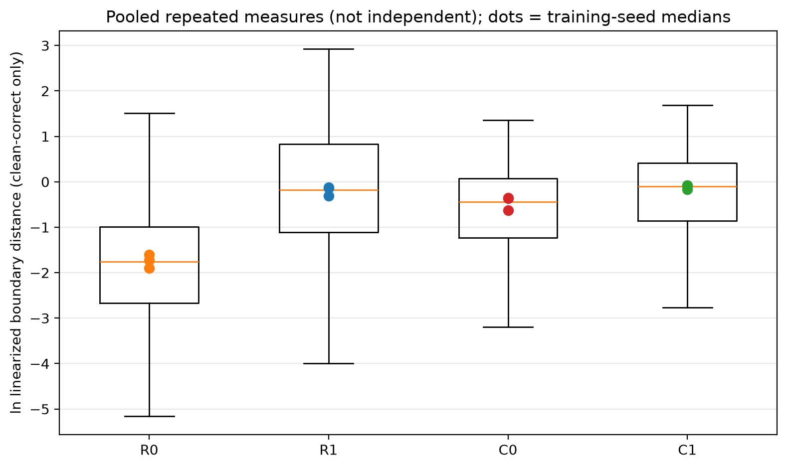
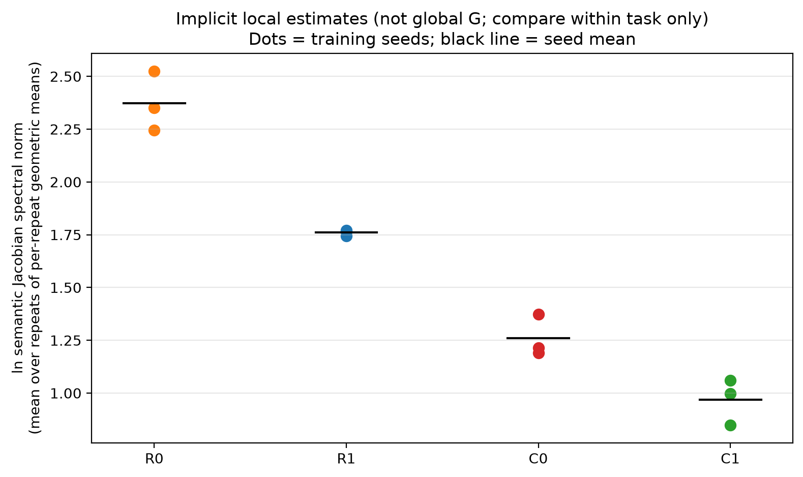
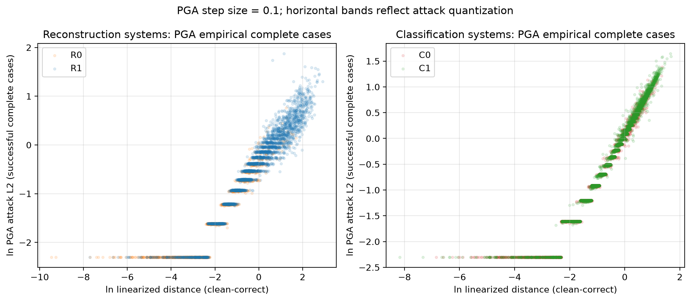

# 共同语义终点与局部敏感性实验结果

> 状态：正式实验完成并通过独立复算审计
> 日期：2026-08-13
> 结论等级：**CAUTION——数据方向可信，但不能作普适或因果外推**

## Material Passport

- 产物类型：实验结果与长期研究备忘录
- 研究对象：CIFAR-10 图像重建/分类、AWGN 信道训练与经验攻击鲁棒性
- 正式规模：4 个条件 × 3 个训练种子 × 3 个信道噪声重复 × 1000 个样本，共 36,000 行诊断
- 独立推断单位：3 个训练种子；同一种子内的 3 个信道重复先平均
- 共同语义终点：CIFAR-10 是否误分类
- 攻击：保留现有 PGA，步长 0.1、最多 2000 步、无 refine
- 主要限制：只有 3 个训练种子；单一离散攻击；共同正确样本和 margin 匹配都涉及处理后筛选

## 一句话结论

在当前固定 DeepJSCC 结构和 10 dB AWGN 测试条件下，加入 AWGN 的训练同时改善了重建组和分类组的 clean 语义性能、PGA 经验攻击抗性与局部平滑性；因此，这种现象**不是重建任务所必需，也不能被解释成语义通信独有的内生鲁棒性**，更符合一般噪声训练、平滑正则化或训练—测试信道分布匹配的解释。

这次结果也不支持“高斯噪声只改善 clean 性能、实质鲁棒性完全没有提升”这一最强说法：匹配相近 clean margin 后，两类任务仍保留了较小但同方向的局部敏感性与 PGA 改善。不过，这些结果仍不是认证鲁棒性、全局 Lipschitz 常数证明或因果机制识别。

## 1. 研究问题

本次实验回答三个问题：

1. 噪声训练带来的系统级攻击抗性，是否主要来自更高的 clean 性能和更大的 clean margin？
2. 把重建和分类转换成同一个“类别语义是否保留”的失败事件后，噪声训练收益是否同时出现在两种任务？
3. 不显式构造每个样本的巨大 Jacobian，能否用局部梯度和隐式谱范数判断映射是否更平滑？

实验得到的是第三种“混合情况”：两种任务都有收益，而重建组的巨大总收益很大程度上又被 clean 正确率和 margin 放大。

## 2. 四个条件与公平控制

| 条件 | 训练目标 | 训练时信道噪声 | 10 dB 测试时共同语义输出 |
|---|---|---:|---|
| R0 | 图像重建 MSE | 无 | 重建图像 → 冻结 ResNet-18 → logits |
| R1 | 图像重建 MSE | 10 dB AWGN | 重建图像 → 冻结 ResNet-18 → logits |
| C0 | CIFAR-10 分类 CE | 无 | 模型自身分类 logits |
| C1 | CIFAR-10 分类 CE | 10 dB AWGN | 模型自身分类 logits |

四组均使用相同的 768 维单位功率 latent、相同 DeepJSCC 主体结构、相同 CIFAR-10 测试子集和相同测试信道条件。每个正式作业固定抽取 1000 张图，每类恰好 100 张。

对同一个训练种子和噪声重复，R0/R1/C0/C1 使用完全相同的 dataset index；同一重复还使用完全相同的 CPU float32 标准高斯噪声矩阵。样本索引与噪声都写入 SHA-256，以避免“看起来共享、实际上随机数不同”的伪配对。

这里的 **clean** 指“不加对抗扰动”，但仍保留 10 dB 的正常 AWGN 信道噪声，不等于无信道噪声。

### 冻结语义评价器

重建路径使用独立训练并冻结的 CIFAR-10 ResNet-18 作为语义读出器：

- 训练/验证/测试：45,000 / 5,000 / 10,000；
- 最佳 epoch：197；
- 最佳验证准确率：95.44%；
- 原图测试准确率：95.42%；
- checkpoint SHA-256：`2a6f0d6d3cc55c6225235641d937051c79bb2745f80cea1b62afc593f9cc0140`；
- 参数被冻结，但输入梯度保留，因此可以从类别失败分数反传到接收信号。

## 3. 指标怎样定义

对真实类别 `y` 和语义 logits `f(r)`，定义失败分数：

> **s(r) = max(k != y) f_k(r) - f_y(r)**

当 `s(r) >= 0` 时系统已经误分类。对 clean-correct 样本：

> **m = -s(r) > 0**
> **g = norm_2(grad_r s(r))**
> **rho_lin = m / g**

- `clean margin`（m）：当前样本离类别决策边界的 logit 间隔；它本身就是系统优良性能的一部分。
- `margin gradient`（g）：失败分数对接收信号的局部梯度大小；越小通常表示当前位置越不敏感。
- `linearized distance`（rho_lin）：一阶线性近似下到失败边界的距离。
- `semantic spectral norm`：从接收信号到语义 logits 的局部 Jacobian 最大奇异值估计。
- `PGA L2`：现有 PGA 第一次使样本失败时的扰动 L2 范数。

必须强调：`rho_lin = m/g` 是定义上的代数恒等式，不是“margin 和 Jacobian 分别造成鲁棒性”的因果分解。

### Jacobian 没有被逐样本显式保存

实验通过 JVP/VJP 幂迭代估计局部最大奇异值，默认比较 20/30 轮，未收敛样本延长到 60 轮。因此不需要显式构造每个样本的完整 Jacobian：

- 36,000 行全部得到有限梯度；
- 99.85% 的局部谱范数在 30 轮内收敛；
- 只有 54/36,000 个样本延长到 60 轮；
- 没有 NaN。

这个量是**采样点附近的局部谱范数**，不是论文中的全局 Lipschitz 常数 `G`。另外，不同任务的 logit 缩放和输出头不同，所以谱范数只能主要比较 R1/R0、C1/C0，不能用 R 与 C 的绝对值直接排序。

## 4. 两种统计口径

### 4.1 系统总效果

`all samples` 保留所有样本；若没有对抗扰动时已经语义错误，则把失败功率记为 0。这回答“部署系统总体需要多大扰动才进入不可接受状态”，clean 正确率和 margin 都属于总效果的一部分。

### 4.2 条件局部效果

任务内的主要条件比较只使用 R0/R1 或 C0/C1 **两两共同 clean-correct** 的样本，避免让另一任务决定本任务的样本范围。四组共同正确交集只保留为跨任务描述，不用于主要任务内结论。

但共同正确仍是训练后的变量，因此有 survivor/collider 选择风险。它有助于观察机制，不是无偏的总体因果效应。

## 5. 正式结果

表中 `±` 是三个训练种子之间的标准差；三个信道重复已经先在各自种子内平均。

### 5.1 系统性能与经验鲁棒曲线

| 指标 | R0 | R1 | R1−R0 | C0 | C1 | C1−C0 |
|---|---:|---:|---:|---:|---:|---:|
| clean 语义准确率 | 19.57% ± 2.45% | 72.40% ± 2.52% | **+52.83 ± 3.34 个百分点** | 57.96% ± 1.05% | 61.13% ± 3.02% | **+3.18 ± 2.29 个百分点** |
| 两两共同正确 AUC | 0.04712 ± 0.00723 | 0.21536 ± 0.00673 | **+0.16824 ± 0.01326** | 0.21194 ± 0.02057 | 0.28370 ± 0.00830 | **+0.07176 ± 0.01295** |
| 全样本 AUC | 0.00860 ± 0.00054 | 0.13684 ± 0.00752 | **+0.12825 ± 0.00776** | 0.11173 ± 0.01532 | 0.15559 ± 0.01365 | **+0.04385 ± 0.00603** |

AUC 是固定 `[-40, 0] dB`、1 dB 网格上的操作性描述指标，不是任务无关的物理常数。应优先看曲线和差值，不能把 AUC 比值直接称为“鲁棒性提高多少倍”。



所有 clean-correct 样本最终都被当前 PGA 找到攻击成功点，所以预设的乐观/保守经验包络在这批数据上完全重合。重合只说明没有右删失，**不代表认证鲁棒性，也不代表 PGA 找到了真正的最小扰动**。

### 5.2 未匹配 margin 的配对局部诊断

下表给出“噪声训练 / 无噪声训练”的几何倍率。小于 1 表示量下降。

| 指标 | R1/R0 | C1/C0 | 解释 |
|---|---:|---:|---|
| clean margin | **2.566×** | 1.085× | R 的总收益包含很大的 margin 增长；C 的 margin 较弱且有一个 seed 反向 |
| margin gradient L2 | **0.416×** | **0.727×** | 分别下降 58.4% 和 27.3% |
| 线性化边界距离 | **6.171×** | **1.493×** | 同时包含 margin 与梯度贡献 |
| PGA 攻击 L2 | **2.922×** | **1.451×** | 都需要更大的经验攻击范数 |
| 局部语义 Jacobian 谱范数 | **0.433×** | **0.749×** | 两种任务内都出现局部平滑信号 |

除 C 组 clean margin 外，其余主要方向在三个训练种子上保持一致。独立复算还发现 R 路径原生图像 decoder 的局部谱范数约降至 `0.395×`，说明 R 组的平滑信号并非只由外接冻结分类器产生。







### 5.3 匹配相近 clean margin 后

为了观察 margin 相近时是否仍存在敏感性差异，实验在相同类别、训练种子和信道重复内，以 pooled SD 的 0.2 为 caliper 匹配 log margin。

| 匹配后指标 | R1/R0 | C1/C0 |
|---|---:|---:|
| 匹配样本—重复对 | 1194 | 4145 |
| 可匹配容量利用率 | 68.0% | 81.8% |
| margin gradient L2 | **0.810×** | **0.728×** |
| 线性化边界距离 | **1.241×** | **1.373×** |
| PGA 攻击 L2 | **1.164×** | **1.342×** |
| 局部语义 Jacobian 谱范数 | **0.792×** | **0.749×** |

两个匹配都覆盖三个训练种子和每个种子的三个噪声重复，各 seed 的 margin 标准化均差绝对值均小于 0.1，因此“匹配可行且 margin 平衡”这一技术检查通过。

结果说明：

- R 组的原始 PGA L2 增益从 2.922× 缩小到约 1.164×，说明其巨大总收益很大程度上与 clean 正确率、margin 和被比较样本分布有关；
- C 组从 1.451× 缩小到约 1.342×，同时梯度和谱范数仍约下降 27% 和 25%；
- 所以效果不能被“完全由 clean margin 增大”解释，但剩余结果只能称为**处理后条件敏感性信号**。

不能把这张表当作充分的中介因果分解：R 的 1194 对中只有 10 对是同一图片，C 的 4145 对中只有 88 对是同一图片；绝大多数匹配对也没有共享同一个样本位置的噪声向量。这些数字还是 sample × noise-repeat 记录，而不是 1194/4145 个独立模型。真正的独立推断单位仍只有三个训练种子。



图中的水平条带来自 PGA 步长 0.1 的离散量化。线性化距离与 PGA L2 的相关系数约为 0.90–0.97，但二者都基于同一失败分数和局部梯度，PGA 也沿该梯度推进，因此这个相关性只能作为一致性检查，不能作为独立机制证据。

## 6. 对原论文主张意味着什么

### 可以支持的结论

1. 在当前结构、10 dB 条件和三个训练种子内，AWGN 训练改善了系统总效果。
2. 在两两共同 clean-correct 样本上，噪声训练模型通常需要更大的 PGA 扰动。
3. 局部梯度、线性化距离和隐式谱范数与“噪声训练使局部映射更平滑”相容。
4. 分类任务也出现同方向效果，因此**重建任务不是该现象的必要条件**。
5. 这更符合通用噪声训练、正则化或信道分布匹配，而不是“语义通信天然具有意外鲁棒性”的独有解释。

### 不能支持的结论

1. 不能声称获得了认证鲁棒性或普适鲁棒性。
2. 不能由局部谱范数推出全局 Lipschitz 常数 `G` 必然很小。
3. 不能证明 Jacobian 变小是唯一或主要因果机制。
4. 不能直接说已经彻底证伪“语义通信”：C 组仍然保留 768 维通信瓶颈，并不是普通无通信分类网络。
5. 不能直接横向说 R 比 C 更鲁棒；两者虽然共享误分类终点，但映射、输出头、logit 尺度和 clean 基线不同。

因此，对论文最准确的评价不是“现象不存在”，而是：**现象能够复现，但它缺乏语义通信特异性；现有证据不足以支持更强的理论和因果解释。**

## 7. 为什么不能简单说“只是防止过拟合”

四组最佳 checkpoint epoch 差异很大：

- R0：5 / 8 / 7；
- R1：942 / 1000 / 992；
- C0：20 / 20 / 20；
- C1：18 / 29 / 26。

这强烈说明噪声训练改变了优化和泛化过程，尤其 R0 很早就达到最佳验证点。因而“噪声抑制过拟合、改善训练—测试信道匹配”很可能是总效果的重要组成部分。

不过，完全否认鲁棒性提升也不符合当前数据：C 组 clean 准确率只增加约 3.18 个百分点，但其 PGA L2、线性化距离和局部谱范数仍在三个 seed 上总体同向改善，且 margin 匹配后仍保留。更准确的表述是：

> 噪声训练确实改善了当前攻击下的经验鲁棒性，但这种改善可以由通用正则化、局部平滑和分布匹配解释，不构成语义通信特有鲁棒性的证据。

## 8. PGA 数值怎样读

- 表中的 `2.922×` 和 `1.451×` 是攻击扰动 **L2 范数**倍率，不是准确率倍率，也不是 AUC 倍率。
- 每信道使用攻击功率是 `norm_2(delta)^2 / 768`，范数倍率与功率倍率不能混用。
- 以前得到的 `16.46×` 使用了不同的原生失败阈值和样本口径，不能与本次共同语义终点的 L2 倍率直接比较。
- 当前 PGA 是单一求解器、步长 0.1、无细化、无多起点。R0 的 clean-correct 样本中约 31.7% 一步越界、约 54.0% 两步内越界，因此数值存在明显量化误差。
- 本次所有 clean-correct 样本均攻击成功，解决了删失问题，但仍不能保证首次越界点就是最小对抗扰动。

## 9. 统计谬误 11/11 扫描

| 检查项 | 结论 |
|---|---|
| Simpson 悖论 | 主要 AUC、梯度、距离和 PGA 在三个 seed 上未反转；C margin 有一个 seed 反向，已披露异质性 |
| 生态谬误 | 三个模型种子的均值不能推广到所有网络、数据集或单个样本 |
| Berkson 偏差 | 共同正确与 matched 子集都经过筛选，存在风险 |
| Collider 偏差 | clean correctness 和 margin 都是训练后的变量，条件化分析不能冒充总体因果效应 |
| 基率忽略 | 测试子集类别平衡，不代表真实部署类别先验；条件曲线也不代表全样本 |
| 回归均值 | 独立测试集降低风险，但 best-validation checkpoint 与极端 epoch 差异仍需注意 |
| 幸存者偏差 | 36 个作业无流失；但 clean-correct/matched 分析只保留“幸存”样本 |
| 多重探索 | 同时观察多项指标和口径，未作多重比较校正，只能视为探索性证据 |
| 分叉路径 | AUC 网格、0.2 caliper、几何均值和 PGA 参数并非正式预注册，结论需谨慎 |
| 相关不等于因果 | 噪声开关可描述固定训练流程的总对比；局部指标和 matching 不能识别唯一机制 |
| 反向因果 | 不能由“低 Jacobian 与高 PGA 同时出现”推出前者造成后者；二者可能共同来自训练质量 |

总体审计等级为 `CAUTION`，不是 `RED_FLAG`：配对数据和结果方向可信，但选择后的机制分析、因果解释及外部推广不可信。

## 10. 完整性与异常记录

- 36/36 正式作业完成，36,000/36,000 行通过 schema、数值和 SHA-256 校验；
- 每个重复只有一个共享噪声哈希，全实验只有一个共享样本索引哈希；
- 正式诊断执行前冻结了 10 个关键源码文件的哈希，独立审计确认运行后仍一致；
- 所有 clean-correct PGA 均成功，没有失败样本被静默丢弃；
- 没有重跑或替换任何正式诊断作业；
- 第一次分析因 cell 列表排序检查写成了顺序比较而中止，修正为集合等价检查后只重跑分析，没有更改正式诊断数据；
- 后续仅调整图例和文字标签，五个数值产物的 SHA-256 在重绘前后保持不变。

## 11. 产物位置与复现命令

适合 Git 长期保存的小型产物位于：

```text
results/factorial_2x2/mechanism_v1/
```

其中包含分析摘要、seed 级汇总、配对效应、margin 匹配记录、经验曲线、五张图、评价器 manifest、正式批次 manifest、registry 和源码快照。原始 36 份逐样本诊断保留在本地 `outputs/`，按仓库规则不提交 Git。

主要入口：

```powershell
# 训练冻结语义评价器
python scripts/train_frozen_cifar10_resnet18.py `
  --epochs 200 --patience 30 --batch-size 128 `
  --evaluation-batch-size 512 --workers 4 --device cuda `
  --output outputs/factorial/factorial_mechanism_v1/frozen_resnet18

# 正式运行 36 组诊断；脚本具有锁、源码哈希和 batch shard 断点恢复
python scripts/run_mechanism_batch.py --device cuda --workers 0

# 严格校验 36 组后分析和绘图
python scripts/analyze_mechanism.py
```

关键程序：

- `semantic_robustness/semantic_evaluator.py`：冻结 CIFAR-10 ResNet-18；
- `semantic_robustness/mechanism.py`：共享样本/噪声、批量 JVP/VJP 与局部诊断；
- `semantic_robustness/theory.py`：failure margin 与局部谱范数 API；
- `scripts/evaluate_mechanism_cell.py`：单作业逐样本诊断；
- `scripts/run_mechanism_batch.py`：36 作业批处理、锁和恢复；
- `scripts/analyze_mechanism.py`：严格输入校验、seed 级聚合、匹配分析和绘图。

## 12. 最终判断

本轮实验已经得到可信且可观的结果，可以停止继续“检查到出现可信结果”为止的循环。

最合适的研究结论是：

> 当前实验复现了噪声训练后的经验鲁棒现象，但分类任务也出现该现象，且重建组的大幅收益又明显受到 clean 正确率和 margin 的放大。因此，结果削弱了“鲁棒性来自语义通信或连续重建任务本身”的解释，支持“通用噪声训练、正则化、局部平滑与信道分布匹配”的替代解释；它尚不足以证明或彻底证伪更广义的语义通信鲁棒性命题。
